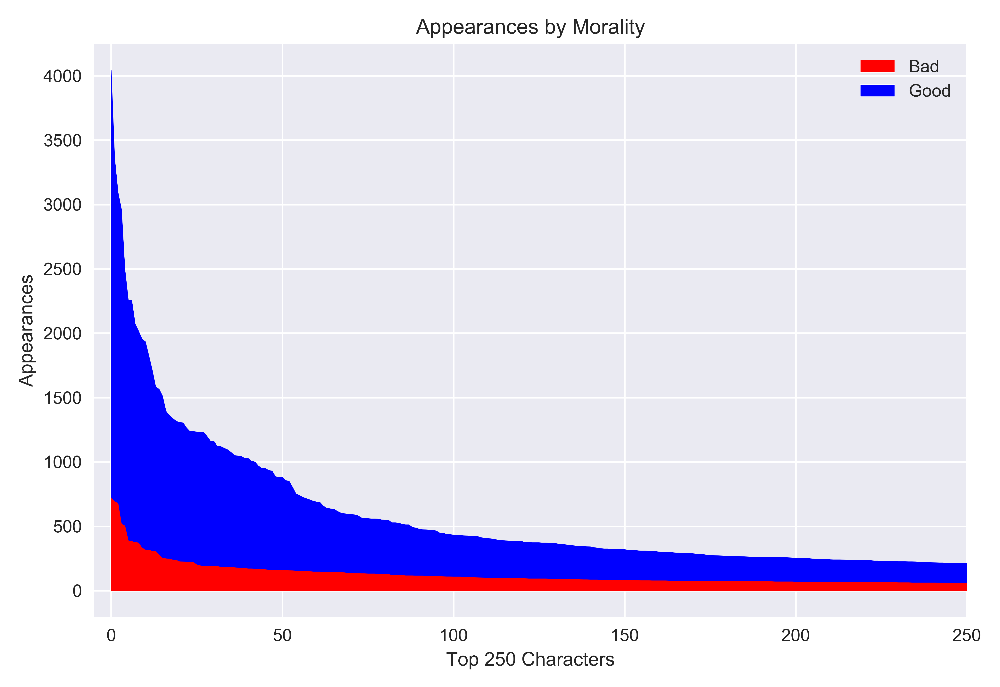
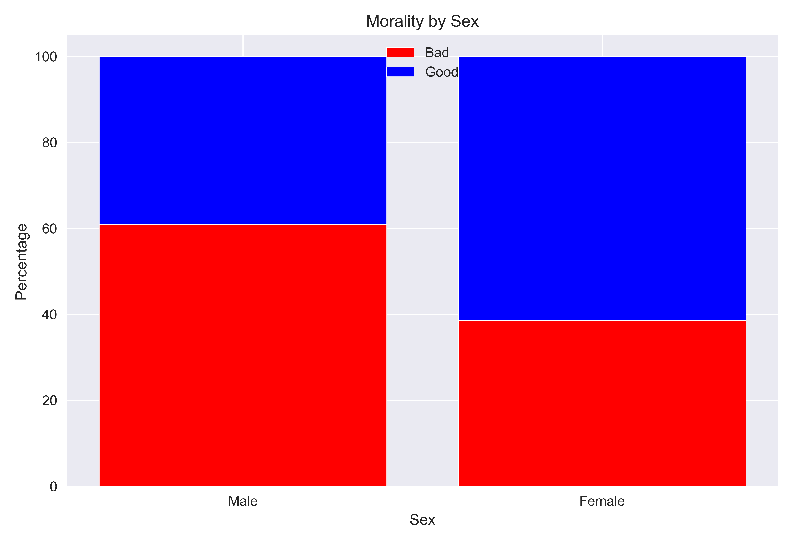
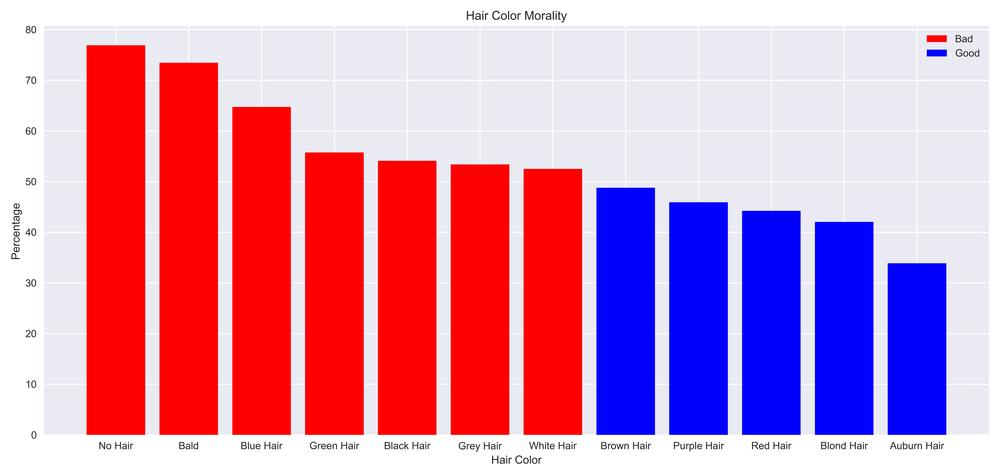

# The Sentinel (Super Hero Morality Predictor)
**Predicting whether comic book characters are good or evil**
 Walker Stevens
\
[Linkedin](https://www.linkedin.com/in/walker-stevens-31783087/) | [Github](https://github.com/walker777007)
\
[Slides](https://docs.google.com/presentation/d/1P7B_7BOsmnOh5gjEXYo_EOSriYO3FBwkCnnmfi7P5f4/edit?usp=sharing)

## Table of Contents

* [Motivation](#motivation)
* [Data Exploration](#data-exploration)
  * [Pipeline](#pipeline)
  * [Moral Inequality](#moral-inequality)
* [Machine Learning Modeling](#machine-learning-models)
  * [Scoring Comparisons](#scoring-comparisons)
  * [Best Model](#best-model)
* [Conclusion](#conclusion)

## Motivation

In the Marvel comics, there are robots called [Sentinels](https://marvel.fandom.com/wiki/Sentinels), who hunt down [Mutants](https://marvel.fandom.com/wiki/Mutants)(super-humans).  My idea is "What if we could create a model that could predict whether a comic book character was good or evil based on all the known information about them?"  Essentially, can we create a new type of Sentinel that has a moral compass when it hunts down superheros/villains?  Giving robots the ability to decide who is good or evil can't go wrong, right?

## Data exploration

### Pipeline

Where I got the data:
* DC Characters Info: [DC Wikia](https://dc.fandom.com/wiki/DC_Comics_Database)
* Marvel Characters Info : [Marvel Wikia](https://marvel.fandom.com/wiki/Marvel_Database/)

In an [article Fivethirtyeight wrote in 2014](https://fivethirtyeight.com/features/women-in-comic-books/), they scraped both these wikis and compiled them into two separate csv files which they now host on their [Github](https://github.com/fivethirtyeight/data/tree/master/comic-characters).

Features that they scraped about each character:
* Alignment: Whether the character is Good, Bad or Neutral
* ID: Whether they have a public, secret identity, etc.
* Eye Color
* Hair Color
* Sex
* GSM: Gender or Sexual Minority
* Alive: Whether the character is currently alive or dead
* Appearances: The number of appearances the character has had in comics
* Year: The year the character was introduced

Once all the data CSV files were collected, I used pandas in order to group them into dataframes, and proceeded to do all my calculations and tests after.

### Moral inequality

Before going on to modeling, I did some exploratory data analysis to see which features were most correlated with a character being good or bad.  What I found is that there is quite the "moral inequality" when it comes to certain characteristics.

As we can see below, the most popular (most appearances) characters tend to be good.  The top 50 good characters all have more appearances than the most popular bad character.

Another discrepancy in good vs evil characters is their sex.  Bad characters tend to be overwhelmingly male and female characters tend to be good.

In terms of physical characteristics, there is also a morality imbalance.  Characters who have red eyes are disproportionately evil whereas blue eyed characters are mostly good.  As well, there seems to be quite the bias against bald characters, as they tend to be more evil as well.

